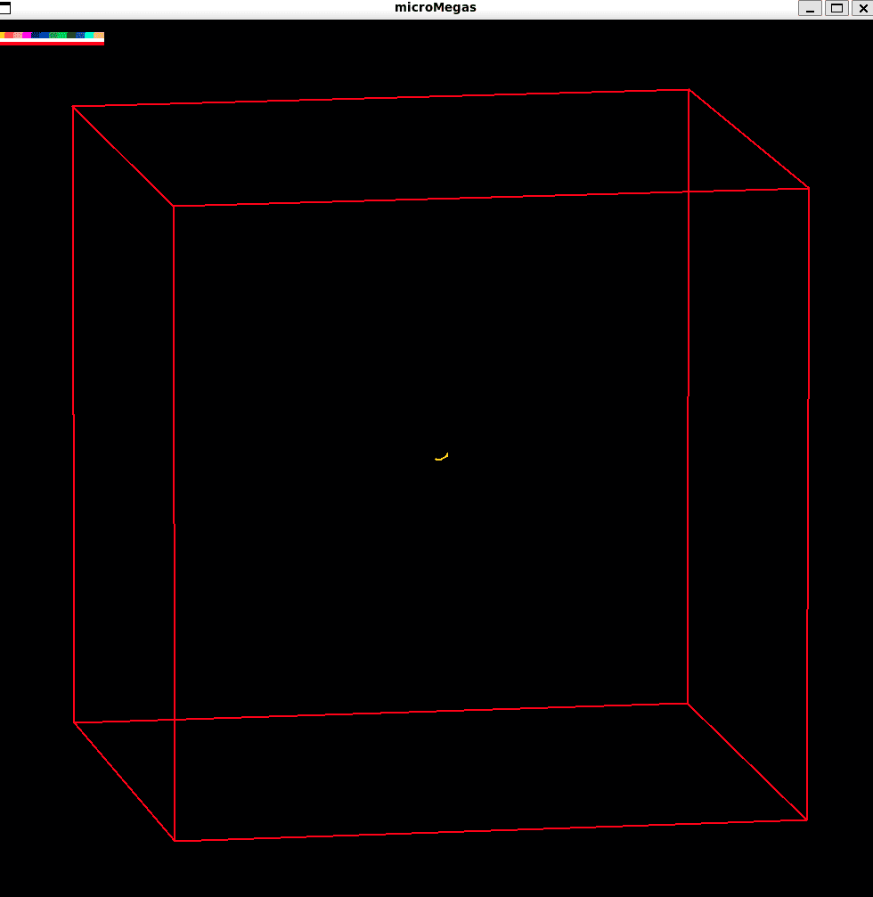
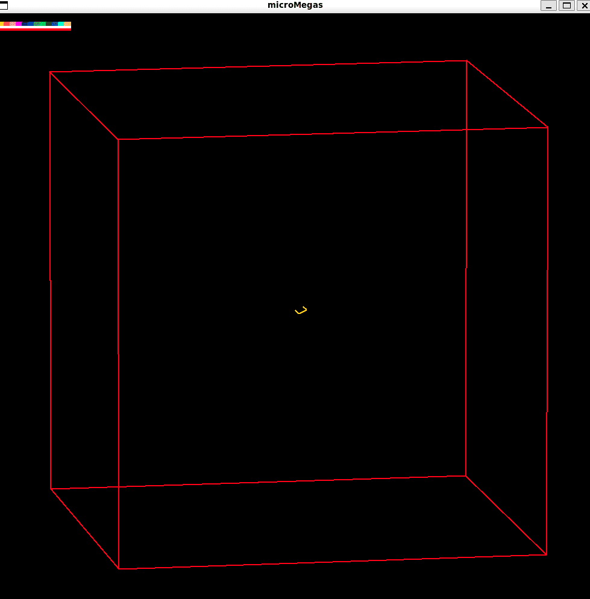
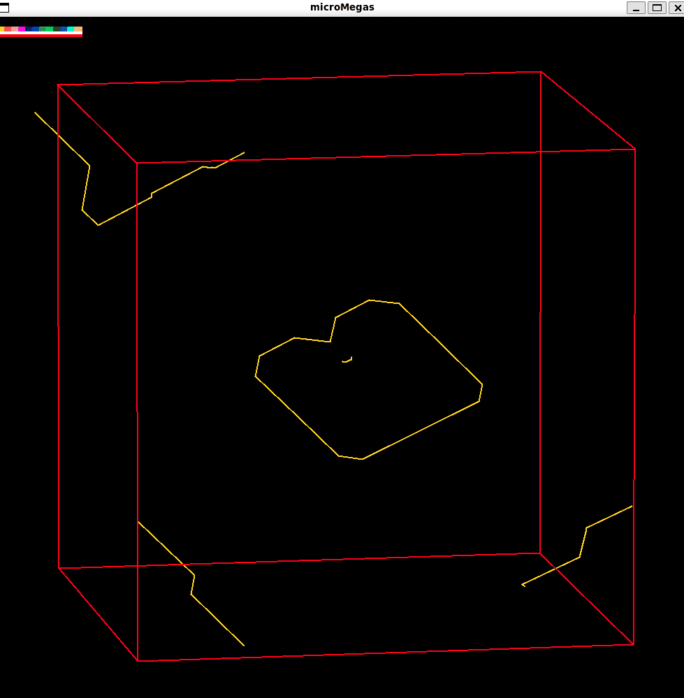
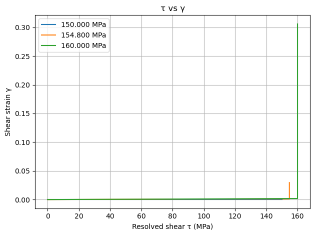
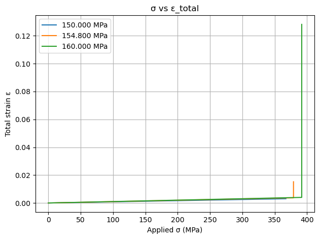
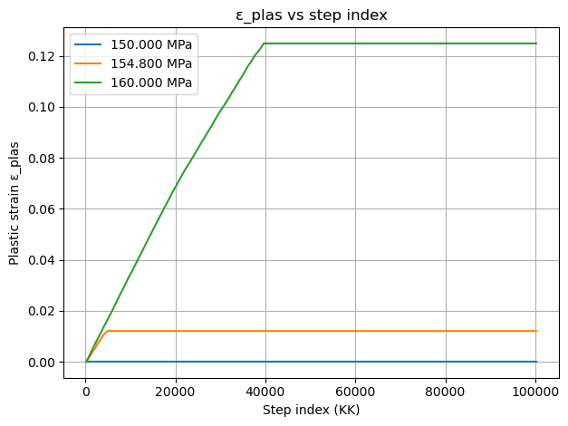
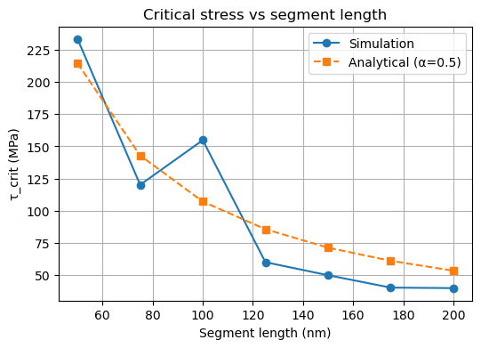
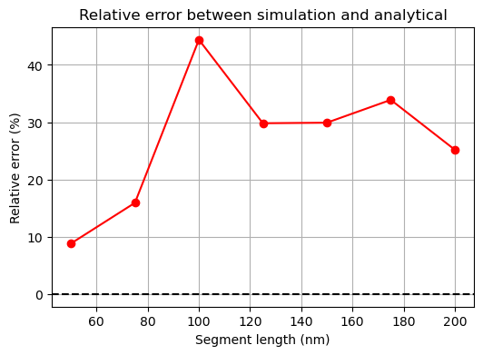

# Frank-Read Source in FCC Cu — Discrete Dislocation Dynamics

**Course:** Materials Simulation Practical | FAU Erlangen-Nürnberg  
**Tools:** Python · microMegas (mM) · NumPy · Matplotlib · pandas

💻 [Notebook (report + code)](frank_read_source_Cu.ipynb)

---

## Overview

Discrete Dislocation Dynamics (DDD) simulations of Frank-Read source activation in FCC copper using microMegas (mM). A pinned edge dislocation segment on the $(\bar{1}\bar{1}\bar{1})$ slip plane with Burgers vector $\mathbf{b} \parallel [10\bar{1}]$ is subjected to an applied resolved shear stress. Three parameter studies are carried out: determination of the critical activation stress, its dependence on segment length, and the extraction of the geometry factor $\alpha$ from the simplified Frank-Read relation $\tau_\text{crit} = \alpha \mu b / L$.

---

## Task 1 — Critical Stress Determination

A single pinned segment of length $L = 100\,\text{nm}$ ($29\,\text{BVD}$) is set up in a $3\,\mu\text{m} \times 3\,\mu\text{m} \times 3\,\mu\text{m}$ Cu simulation cell. Three stress levels are applied (150, 154.8, and 160 MPa) to bracket the activation threshold. The critical resolved shear stress is defined as the minimum $\tau$ that produces a finite, sustained plastic strain after the initial transient.

<table>
  <tr>
    <td align="center"><br><sub>Far below critical — segment remains pinned</sub></td>
    <td align="center"><br><sub>Below critical — slight bow-out, no activation</sub></td>
    <td align="center"><br><sub>At/above critical — loop emitted, arms exit box</sub></td>
  </tr>
</table>

The $\tau$–$\gamma$ and $\sigma$–$\varepsilon$ curves confirm that no measurable shear strain develops at $150\,\text{MPa}$, a finite but limited response appears at $154.8\,\text{MPa}$, and full activation with large plastic strain occurs at $160\,\text{MPa}$. The critical stress is identified as $\tau_\text{crit} \approx 154.8\,\text{MPa}$.

<table>
  <tr>
    <td align="center"><br><sub>Resolved shear stress τ vs. shear strain γ</sub></td>
    <td align="center"><br><sub>Applied stress σ vs. total strain ε</sub></td>
    <td align="center"><br><sub>Plastic strain ε_plas vs. simulation step</sub></td>
  </tr>
</table>

---

## Task 2 — Critical Stress vs. Segment Length

The segment length is varied from 50 nm to 200 nm in increments of 25 nm. For each length the critical stress is bracketed by simulation and compared to the analytical Frank–Read prediction:

$$\tau_\text{crit} = \frac{2\alpha\mu b}{L}$$

using $\alpha = 0.5$, $\mu = 42\,\text{GPa}$, and $b = 0.25525\,\text{nm}$.

<table>
  <tr>
    <td align="center"><br><sub>τ_crit vs. segment length — simulation vs. analytical (α = 0.5)</sub></td>
    <td align="center"><br><sub>Relative error between simulation and analytical solution</sub></td>
  </tr>
</table>

Both simulation and analytical results follow the expected $\tau_\text{crit} \propto 1/L$ scaling. Best agreement (error < 20%) is at 50–75 nm. The largest deviation (~44%) occurs at 100 nm due to discretisation effects at intermediate lengths. For longer segments (125–200 nm) the error stabilises around 25–35%, consistent with finite box-size effects suppressing full loop expansion.

---

## Task 3 — Orientation Dependence and the α Factor

Starting from the Task 1 geometry, the character angle $\beta$ between the dislocation line and $\mathbf{b}$ is varied from pure edge ($\beta = 90°$) toward pure screw ($\beta = 0°$). In microMegas, segment orientations are selected from the `BVD.CFC` table, which fixes both the line direction and the Burgers vector direction jointly, constraining which mixed characters are accessible on a given slip plane. The effective $\alpha$ is extracted for each orientation via:

$$\alpha = \frac{\tau_\text{crit}\, L}{2\mu b}$$

The analytical expectation (Hirth) gives $\alpha \approx 0.5$ for a pure edge and $\alpha \approx 1.5$ for a pure screw, reflecting the higher line tension of screw segments.

---

## microMegas Simulation

<table>
  <tr>
    <td align="center"><br><sub>DDD simulation — Frank-Read source activation in 3 µm Cu cell</sub></td>
  </tr>
</table>

---

## Requirements

```
pip install numpy matplotlib pandas
```

microMegas (mM) is required to reproduce the raw simulation data. See the [mM project page](http://zig.onera.fr/mm_home_page/) for installation instructions.

---

## Usage

Open `frank_read_source_Cu.ipynb` in Jupyter and run cells sequentially. All analysis and plotting code reads from the `results/` output directories produced by mM. Material parameters and stress ranges are defined at the top of each task section.
